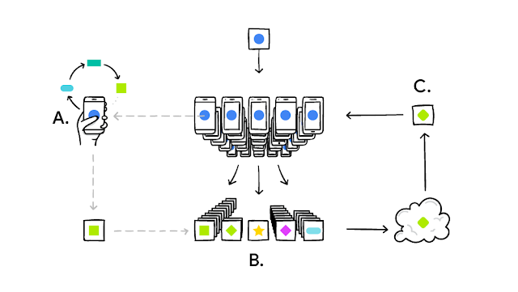

# MLCybersecurity
Machine Learning Cybersecurity projects

- Federated Learning for Image Classification using MNIST dataset

Using TensorFlow Federated and a simple 10 neuron 1 layer dense network and grid searching the best Optimizer, best Client Learning Rate and best Server Learning Rate.

Each client trains the model locally (A). Their updates are aggregated (B) to form an improved shared model (C).

